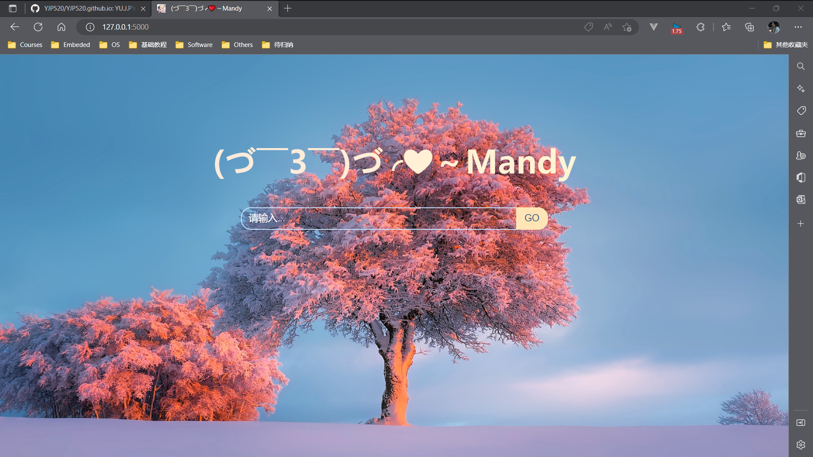
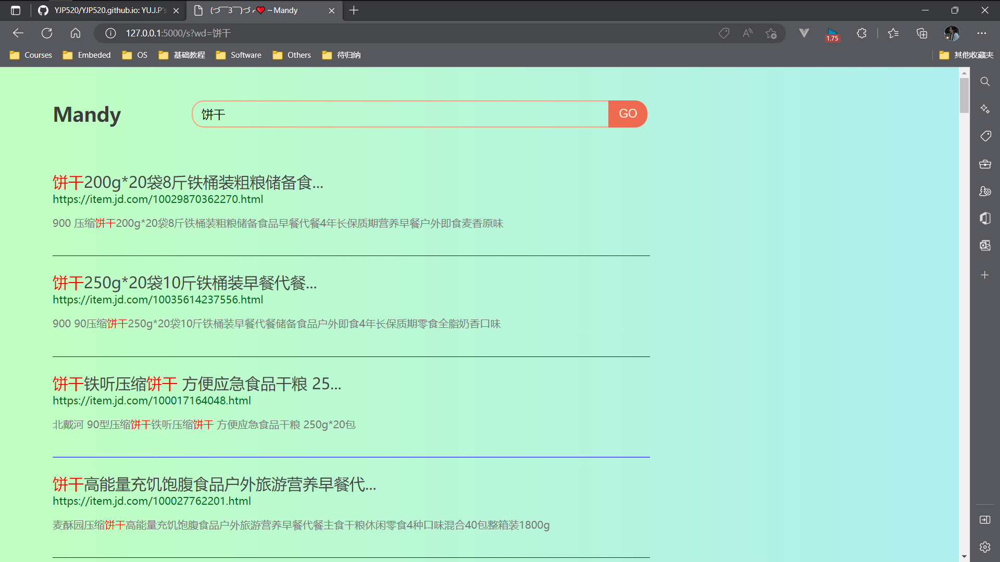

# ***小型搜索引擎 Mandy-SE***
___
    
### **题目编号:S1**

- 开发具有一定功能的小型搜索引擎，至少完成从网上抓取不少于10000个网页。
- 能实现良好的检索及结果展示,并体现一定的智能检索。
- 可以基于开源技术来建立搜索系统。
- 比如:基于Lusene,Sol、Elasticsearch的文本检索系统。

---

### **实现设计**

- 采用面向对象的设计，每个实验归属为独一的实现类；
- 主界面 UI 调用每个已经实现的类；
- 设计整理与经验总结。

---

### **设计思路**

- 多窗口界面设置

---

### **关键**

爬虫源文件
```bash
$ Auto/selenium_spider.py
```

链接数据库源文件
```bash
$ Auto/link_database.py
```

flask框架文件
```bash
$ Src/web_flask.py
```

生成Html函数源文件
```bash
$ Src/createHtml.py
```

摘要自动提取源文件
```bash
$ Core/abstract.py
```

注意事项：
- 在Src目录下需要创建templates与static文件夹，分别作为html文件与网页图片资源的索引文件夹。

---

### **实践展示**

**开始界面**



**搜索界面及结果展示**



---

### **总结**
- 特点
  - 一个基于Flask框架的简易网站信息搜索引擎
  - 使用selenium自动化爬取指定网页数据及链接
  - 以mysql数据库来存储爬虫爬取的数据
  - 实现普通搜索引擎的基本功能
  - 具有简约风格的UI设计展示
- 不足
  - 生成html文件还需要进一步改进
  - 数据展示界面可进一步优化
  - 数据可进一步添加

---

### **参考链接**

[个人Github](https://github.com/)

---